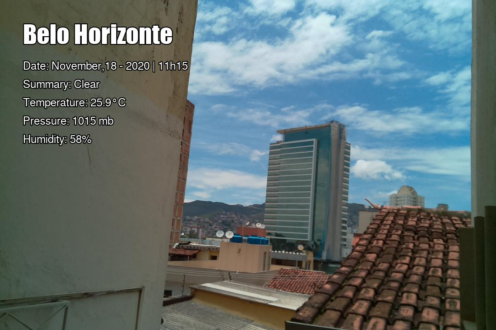

# weather-camera

Usage
=====
For a raspberrypi supporting it, I just made a call via crontab to run
every 60 seconds.

Weather
=======
It was extendend to use as script to gather weather information via
https://openweathermap.org/ API.

Requirements
============
Just found it requires some extra packages to work (at the least on raspbian):
 * ttf-mscorefonts-installer
 * Pillow
 * libopenjp2-7
 * libtiff5
 * ...
 
Bugs
====
No big ones at this moment.
